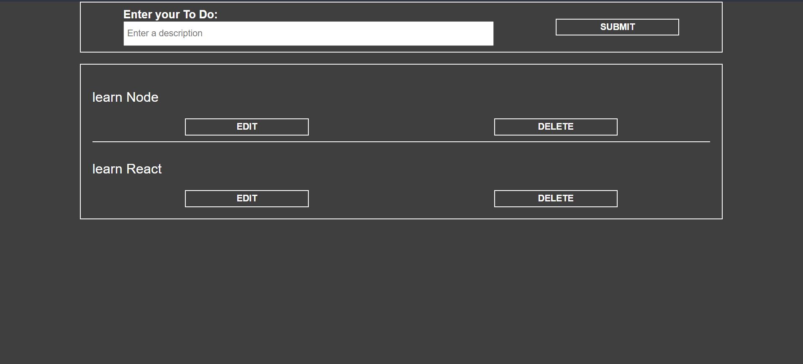

# fullstack-todo

ToDo fullstack App (made with PERN stack)

## Screenshots

## Libraries

1.  [PGADMIN](https://www.pgadmin.org/)
2.  [EXPRESS](https://expressjs.com/)
3.  [REACT](https://en.reactjs.org/)
4.  [NODE](https://nodejs.org/en/)
5.  [SEQUELIZE](https://sequelize.org/)
6.  [AXIOS](https://axios-http.com/docs/intro)

## Install and run project

1. Clone repo.
2. Install modules `npm install` in main, frontend and api folders.
3. Download and install PostgreSQL Tools in [PGADMIN](https://www.pgadmin.org/).
4. Make an account and a database to get keys in PGADMIN.
5. Check example.config.emv file and create a `config.env` file. 
7. Run project `npm start`.
